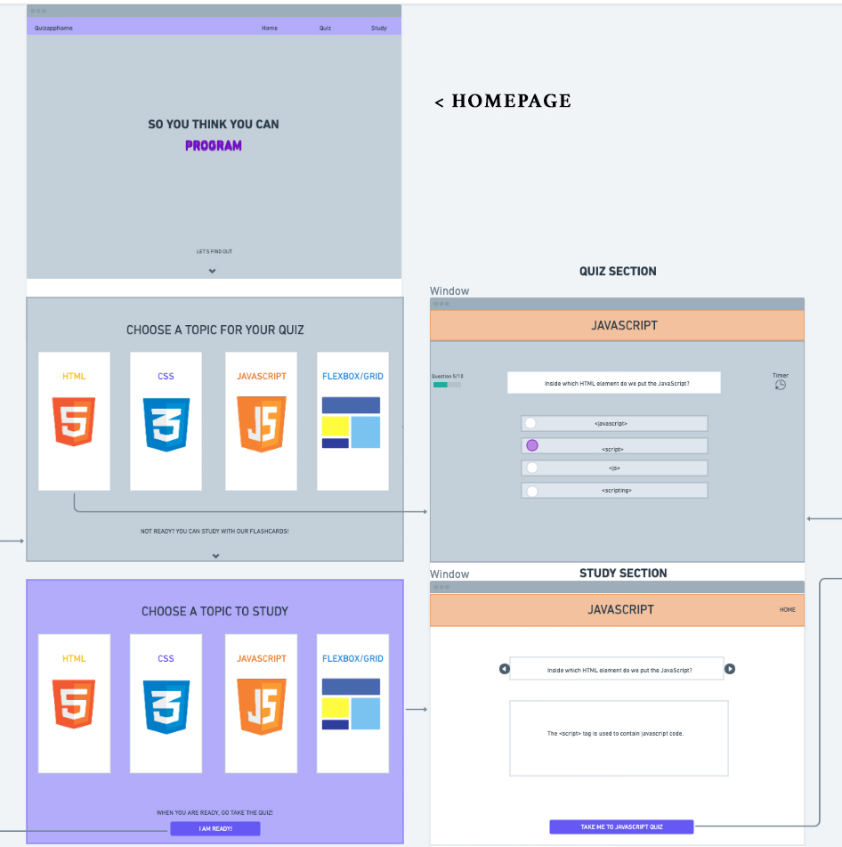

# So You Think You Can Code
## A vanilla JS browser Quiz Game

*website will be included here*

SYTYCC is an online education game that quizzes the user on their programming knowledge. The topics featured in the game are as follow:

- HTML
- CSS
- FLEXBOX/GRID
- JAVASCRIPT

## Features

- User can navigate through the website which features many CSS effects.
- Study the topics in the quiz with flashcards in the study section of the website. 
- Take a quiz on your chosen topic
- Receive a score based on your quiz results and a fail/pass response.
- Have fun learning!

## Tech

SYTYCC uses the following languages and libraries in the developmental process:

- [HTML] -The standard markup language for documents designed to be displayed in a web browser. 
- [CSS] - A style sheet language used for presentation of a wesbite.
- [JAVSCRIPT] - Prototype based object oriented language.
- [Bootstrap] - based design templates for interface components.
- [FLEXBOX] -  A layout model that allows elements to align and distribute space within a container. 
- [GRID] - Enables an author to align elements into columns and rows.

SYTYCC uses the following websites in the developmental process:
- [ICONS8](https://icons8.com/) - Download design elements for free: icons, photos, vector illustrations, and music for your videos.
- [uiGradients](https://uigradients.com/#Venice) - A handpicked collection of beautiful color gradients for designers and developers​.
   
 

# PSEUDOCODE

1.
 ## Home-Page  
Upon loading the page, the user will be presented with the homepage, which includes the _title_, _navigation-bar_, and _logo_
    
     The user can either use the navigation bar to access the contents of the page or scroll to each section. These sections include the Quiz and Study session
2. 
## The Quiz Section  
On the quiz page, the user will have access to 4 different categories of quiz. These categories will include _Html_, _Css_, _Flebox & grid_, and _Javascript_ on the left side of the screen.

On hover, the user will receive the quiz direction on the left side of the screen. This direction will read as follow:

                            Quiz Name
    This quiz contains 10 questions and there is no time limit. A minimum socre of 70% is required to win the game. Click to start!

_The user will also be presented with a button that reads "**I am not read**" Upon clicking this button, the user will be redirected to the study session, which will open on a new page._

### If the user select a topic to be quizzed on, the user will be directed to the quiz section of that category.

- On the quiz page, the user will be presented with a navigation bar that includes the _home_ and all the other _quiz categories_
        
        Clicking any of the quiz categories will result in the user switching over to that quiz. Clicking the home menu will redirect the user to the landing page.

- The quiz section includes a tracker at the top to track the question the user is on. This will be out of 10 questions. This will be followed by the actual question and 4 different options for the user to choose from and a next button to go to the next question. A timer will also be present at the top of the quiz box to track the duration of the quiz.

        If the user selects the correct option, the box of that option will change to a color of green and a message at the bottom that reads "You know your stuff!"

        Otherwise, if the user selects the incorrect option, the box of that option will change to a color of red, the correct answer will also appear with a color of green and a message at the bottom that reads "You will get it next time!"

- At the end of the quiz(10 questions), the user will receive a new box that pops up as an evaluation box. This box will report the user's score, a pass or fail response, the duration of the quiz, and a button to try again. An example of this will read as follow:

                        Your Evaluation
        You got 4 out of 10 answers correct. That is 40%.
            You failed. A minimum score of 70% is required to win the game.
            It took you 8 minutes and 38 seconds to complete the quiz.

_There is also a toggle button at the top of the page that will switch the style to a dark or light mode_

3.

 ## Study section  
The study page includes 4 categories. These categories are the same as the categories for the quiz. The user will see a message at the top that reads 
    
     Choose a topic to study

- The user will be presented with the 4 label boxes and a button of get started. Upon clicking that button, the user will be redirected to the study section of that category.  
    - The page includes a navbar and a question and answer drop box in the form of an accordion. Clicking on a question will open a drop down box that includes an explanation of the answer. This box will go away as soon as the user clicks on another question.  

At the bottom of the page, there is a text that reads:
    
     Don't like the background color? Click here to change it.
- Upon clicking that text, the user will be faced with a prompt box that asks for a color. If the user enters a color, the background of the page will change to that color. The user can also enter an RGB number or Hex Colors.
            

 # WIREFRAME

 
 
 
 
 
 
 
 
 
            